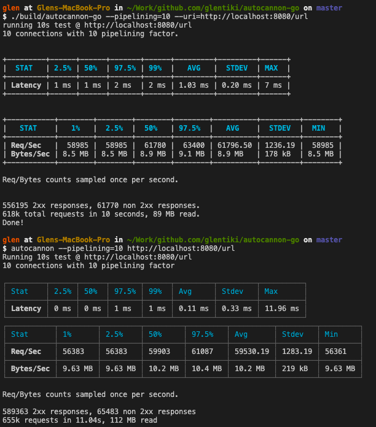

# Autocannon-go

A personal thought experiment to see what writing a golang version of autocannon might be like. implements the _very basic_ default api, without much else feature wise. Not a programmable interface.



## Installing published binaries

Binaries are published in the format: `https://github.com/glentiki/autocannon-go/releases/download/$GIT_TAG/autocannon-go-$SYSTEM-$PLAFORM`

To install on macOS, you would need to run the following and then add to your path:
```
curl -LO "https://github.com/GlenTiki/autocannon-go/releases/download/v0.0.1/autocannon-go-darwin-10.6-amd64" && chmod +x autocannon-go-darwin-10.6-amd64
```
To install on Windows you could install from this link or if you have curl installed then run the following and then add to your path:
```
curl -LO "https://github.com/GlenTiki/autocannon-go/releases/download/v0.0.1/autocannon-go-windows-4.0-amd64.exe"
```
To install on Linux, you could curl the following and then add to your path:
```
curl -LO "https://github.com/GlenTiki/autocannon-go/releases/download/v0.0.1/autocannon-go-linux-amd64" && chmod +x autocannon-go-linux-amd64
```

You can use the following URLs to retrieve autocannon-go as needed, substituting the $GIT_TAG for the released version tag. E.g. v0.0.1.
```
https://github.com/glentiki/autocannon-go/releases/download/$GIT_TAG/autocannon-go-darwin-10.6-amd64
https://github.com/glentiki/autocannon-go/releases/download/$GIT_TAG/autocannon-go-darwin-10.6–386
https://github.com/glentiki/autocannon-go/releases/download/$GIT_TAG/autocannon-go-linux-amd64
https://github.com/glentiki/autocannon-go/releases/download/$GIT_TAG/autocannon-go-linux-386
https://github.com/glentiki/autocannon-go/releases/download/$GIT_TAG/autocannon-go-windows-4.0-amd64.exe
https://github.com/glentiki/autocannon-go/releases/download/$GIT_TAG/autocannon-go-windows-4.0-386.exe
```

## LICENSE

MIT License. See [LICENSE](./LICENSE) file.
